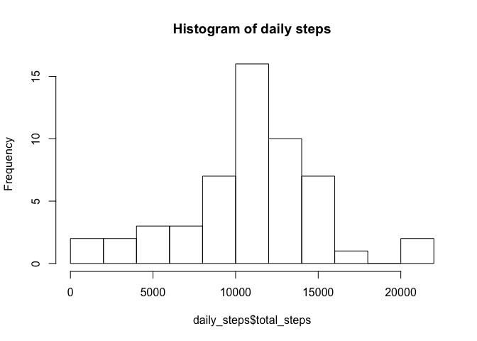
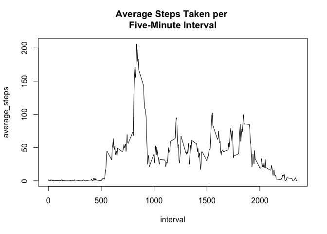
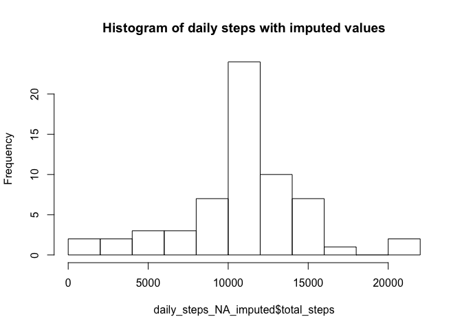
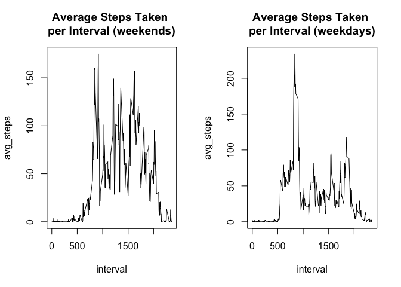

# Reproducible Research: Peer Assessment 1


## Loading and preprocessing the data


```r
## read data from where it has been downloaded in a zip file
activitydata<-read.csv("~/Desktop/Reproducible Research Assignment 1/activity.csv")

str(activitydata)
```

```
## 'data.frame':	17568 obs. of  3 variables:
##  $ steps   : int  NA NA NA NA NA NA NA NA NA NA ...
##  $ date    : Factor w/ 61 levels "2012-10-01","2012-10-02",..: 1 1 1 1 1 1 1 1 1 1 ...
##  $ interval: int  0 5 10 15 20 25 30 35 40 45 ...
```

```r
activitydata$date<-as.Date(activitydata$date)
```

## What is mean total number of steps taken per day?


```r
### selecting sum of steps by date using SQL because I find it easy to manipulat data this weay.


library(sqldf)
```

```
## Loading required package: gsubfn
## Loading required package: proto
```

```
## Warning in doTryCatch(return(expr), name, parentenv, handler): unable to load shared object '/Library/Frameworks/R.framework/Resources/modules//R_X11.so':
##   dlopen(/Library/Frameworks/R.framework/Resources/modules//R_X11.so, 6): Library not loaded: /opt/X11/lib/libSM.6.dylib
##   Referenced from: /Library/Frameworks/R.framework/Resources/modules//R_X11.so
##   Reason: image not found
```

```
## Could not load tcltk.  Will use slower R code instead.
## Loading required package: RSQLite
## Loading required package: DBI
```

```r
daily_steps<-sqldf("select date, sum(steps) total_steps, avg(steps) average_steps from activitydata group by date")

## the data frame daily_steps contains the number of steps for each date. These need transforming to numeric as sqldf has not understood the NAs in the dataset

daily_steps$total_steps<-as.numeric(daily_steps$total_steps)

## Histogram of daily steps

hist(daily_steps$total_steps, breaks = 15, main = 'Histogram of daily steps')
```

 

```r
## calculate mean steps

meanSteps<-mean(daily_steps$total_steps,na.rm=T)

## calculate median steps

medianSteps<-median(daily_steps$total_steps,na.rm=T)
```

* The mean number of steps per day is 


```
## [1] 10766.19
```
* The median number of steps per day is 


```
## [1] 10765
```


## What is the average daily activity pattern?

A time series plot shows the distribution of steps across 5-minute intervals averaged across all days.


```r
## using SQL again, this time to create a data frame showing the average number of steps per 5 minute interval, ignoring date

interval_steps<-sqldf("select avg(steps) average_steps, interval from activitydata  group by interval")


with(interval_steps, plot(x=interval, y=average_steps, type='l',main='Average Steps Taken per \nFive-Minute Interval'))
```

 

* The five minute interval showing the highest average number of steps across all days is 


```r
interval_steps[interval_steps$average_steps == max(interval_steps$average_steps),]
```

```
##     average_steps interval
## 104      206.1698      835
```


## Imputing missing values

The number of rows in the dataset with missing values is


```r
## count rows with NAs
nrow(activitydata)-sum(complete.cases(activitydata))
```

```
## [1] 2304
```

We can impute missing values by using the average value for the 5 minute interval, or when this is missing using the average value for the date


```r
## more SQL (it's my 'native' language and I'm trying to work quickly...) to create a dataset where missing values for steps are imputed as outlined above


activitydata_NA_imputed<-sqldf("
select 
a.date as date
, a.interval as interval
, case when a.steps is null and i.average_steps is not null then i.average_steps when a.steps is null and i.average_steps is null then d.average_steps else a.steps end as steps

from 
 (select 
 * 
 from 
 activitydata) 
 as a 
 left join
  (select 
  *
  from
  interval_steps)
  as i
  on i.interval = a.interval
  left join
   (select
   *
   from
   daily_steps)
   as d
   on d.date = a.date
"
)

## histogram of steps per day with imputed values

daily_steps_NA_imputed<- sqldf("select date, sum(steps) total_steps from activitydata_NA_imputed group by date")

hist(daily_steps_NA_imputed$total_steps,breaks=15,main = 'Histogram of daily steps with imputed values')
```

 

```r
meanImputedSteps<-mean(daily_steps_NA_imputed$total_steps)

medianImputedSteps<-median(daily_steps_NA_imputed$total_steps)
```

* The mean number of daily steps with imputed values was


```
## [1] 10749.77
```

* The median number of daily steps with imputed values was


```
## [1] 10641
```


* Imputing values has kept the histogram a similar shape but added more values around the most common interval, making the distribution appear more concentrated.

* Both the mean and median steps have been reduced.


## Are there differences in activity patterns between weekdays and weekends?


```r
## add weekday as a column to activitydata

activitydata$weekday<-weekdays(activitydata$date)

## add whether the day was a weekday or weekend as a column to activitydata

activitydata$wkday_wknd<-as.factor(ifelse(activitydata$weekday == 'Saturday' | activitydata$weekday ==  'Sunday','weekend','weekday'))

## create a dataset of average steps per five minute interval separating weekdays and weekends

actdat3<-sqldf("select interval, avg(steps) avg_steps, wkday_wknd from activitydata group by wkday_wknd, interval")

## create a panel plot to display weekday vs weekend activity distributions
par(mfrow=c(1,2))
with(actdat3[actdat3$wkday_wknd=='weekend',],plot(interval,avg_steps,type='l', main = "Average Steps Taken \nper Interval (weekends)" ))
with(actdat3[actdat3$wkday_wknd=='weekday',],plot(interval,avg_steps,type='l',main= "Average Steps Taken \nper Interval (weekdays)"))
```

 

* It appears that there is a lot more activity on weekends, although the highest average number of steps within a five-minute interval occurs on weekdays, possibly due to walking to work.

